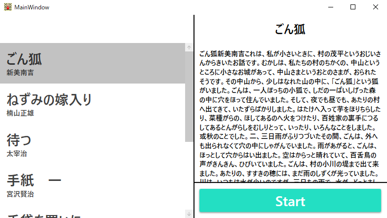
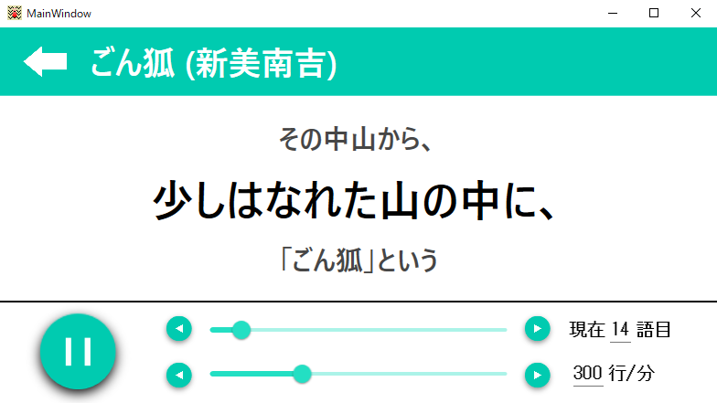
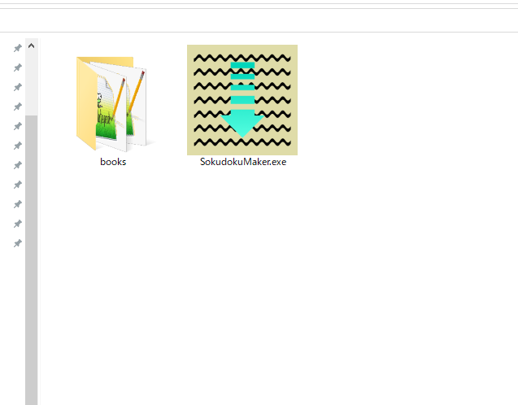

# SokudokuMaker

SokudokuMakerは自分の好きな文章で速読をするためのソフトウェアです．

# DEMO

# Requirement
* WindowsOS

# Download

# Author
つよぽん

# How to use
SokudokuMaker.exeと同じディレクトリにbooksフォルダを配置します．

booksフォルダの中に任意の作品のテキストファイルを配置します．
## テキストファイルの書式
1行目：作品のタイトル \
2行目：作者名 \
3行目以降：本文(速読中の1塊につき改行区切り) \
1塊の目安は3~10文字くらいです．